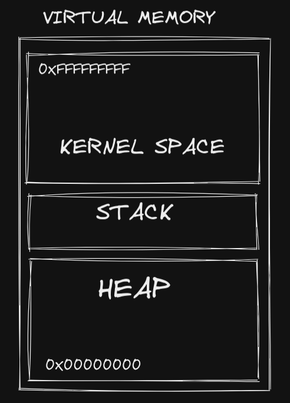

# Hello World como você nunca viu

## Dúvidas ou Tópicos para pesquisar depois
- Algortimo de Multiplicação de Booth
- Stack LIFO e FIFO
- Tail Recursion


## Conteúdo

- **String**: cadeia de caracteres, ou melhor ainda, uma cadeia de bytes terminadas em `\0`. Cada letra é representada por um código de 8 bits que é um byte. **'Hello world'** por exemplo possui, 11 bytes, isso em C, pois em linguagens como Java e C#, cada char representa um caractere UTF-16.
- **Inteiros**: Normalmente são dos tipos: `int8`, `int16`, `int32`, `int64` e até `int128` dependendo da linguagem. Eficiência é razão dessa divisão por `bytes`. Inteiros podem ser também `signed` e também `unsigned`, o que significa que um `unsigned int` pode ir de 0 à 255 e um `int` de -127 à 128.
- **BitInteger** 
- **Float**: Ponto Flutuante, sõa represetados como um `binary64` ou double onde os bit de 62 a 52 são chamados de expoente e de 51 a 0 são a mantiça ou parte fracionária. Já o float é um `binary32`.
- **Array**: Conjunto de elementos do mesmo tipo agrupados sequencialmente. Exemplo, `uint8_t lista[] = {1, 2, 3, 4, 5}`. Quando associamos uma varável à um array, estamos fazendo na realidade estamos apontando para o endereço do primeiro elemento do array. Utilizando o exemplo acima, vamos supor que o elemento 1, ocupa o endereço de memória `$ffffdc73 => 1`, o endereço de memória seguinte, dos próximos elementos serão: `$ffffdc74 => 2, $ffffdc75 => 3, $ffffdc76 => 4, $ffffdc77 => 5`. No exemplo do `Hello World`, temos um array de chars de 12 bytes com um byte nulo no final.


Hello World em C:
```c
#include <stdio.h>

void main() {
  char hello[] = "Hello World";
  printf("%c\n", hello);
  
  return;
}
```
O compilador lê esse código e dá saida em um arquivo binário executável em formato _elf_.
Para acessar o endereço de memória de uma variável em C, precisamos utilizar o **e comercial (&)** antes da variável.
Abaixo teremos um código que contém 3 funções, uma `main` uma `f1` uma `f2`, poderemos ver também a síntaxe de uma função
em C.

```c
#include <stdio.h>

void f2(char hello[]) {
  printf("from f2: %p\n", &hello);
  printf("%s\n", hello);
}

void f1(char hello[]) {
  printf("from f1: %p\n", &hello);
  f2(hello);
}

void main() {
  char hello[] = "Hello world";
  printf("%s\n", hello);
  printf("from main: %p\n", &hello);
  f1(hello);

  return;
}
```
Os programas são executados em uma memória virtual do nosso computador, que pode ser dividida em 3 partes, uma resevada para o kernel do sistema, uma stack, e uma heap. Cada qual tem sua função.



Na memória HEAP, é uma memória dinâmica, é pra onde vai a maioria dos dados que o programa carrega.
Ao executar o programa, ele pede para o Kernel alocar espaço na  para o novo processo.

- **Ponteiros**:
Os ponteiros são como apontadores que apontam para um endereço de memória a partir da Stack para a Heap, fazendo com que não haja sobrecarga na stack por guardar muitos endereços de variáveis. Podemos refatorar o `helloworld` para que ele utilize ponteiros e aloque memória no Heap e não no Stack.

```c
#include <stdio.h>
#include <stdlib.h>
#include <string.h>

void main() {
  char hello[] = "Hello World";
  printf("from main: %p\n", &hello);
  
  char *hello2 = malloc(sizeof(hello));
  strcpy(hello2, hello);
  printf("Hello2: %x\n", hello2);

  char *hello3 = hello2 + 6;
  printf("from hello2: %s\n", hello2);
  printf("from hello2: %s\n", hello3);


  return;
}
```
- **Structure**

```c
#include <stdio.h>
#include <stdlib.h>
#include <string.h>
#include <inttypes.h>

struct Person {
  char name[10];
  uint8_t age;
  uint8_t height;
}

void main() {
  struct Person person;
  strcpy(person.name, "Lucas");
  person.age = 25;
  person.height = 171;

  return;
}
```
