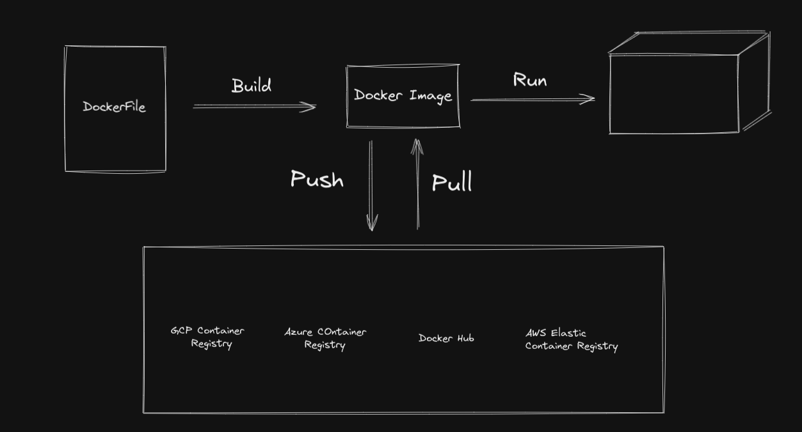

# O que são e como rodar `containers`

Containers são como se fossem pacotes onde guardamos nossas aplicações.
- `container`: é um processo do _Docker_ que possui tudo para o funcionamento de um software, como um sistema operacional e recursos para aplicações.
Como se fossem máquinas virtuais só que mais perfomáticas. Os __containers__ compartilham os mesmos recursos do sistema operacional onde está hospedado.
Um __container__ não deve ser utilizado para abrigar várias aplicações, é essencial que ele tenha fins específicos e objetivos.
É importante diferenciar __container__ de __imagem__. Uma __imagem__ pode se referir a um determinado tipo de __container__. As imagens do _Docker_ podem ser 
encontradas no [Docker Hub](https://hub.docker.com/), que é onde estão os __registros__ das __images__.

A melhor maneira de exemplificar esse fluxo é da seguinte forma:



O _dockerfile_ possui instruções que naõ necessárias para gerar uma imagem. Depois disso, damos um _push_ ou um _pull_ em uma imagem no _Registry_, que podem estar em vários lugares. E por último rodamos a imagem com o `run`.

## Comandos no Docker
Os comandos no _Docker_ possuem a seguinte estrutura:  
`docker <comando> <sub-comando> <params>`. Como por exemplo no
comando `docker run hello-world`, ou de uma maneira mais verbosa `docker container run hello-world`. 
Para rodar qualquer container utilizamos esse comando `docker container run <nome-da-imagem>:<tag>`, onde `<tag>` é a versão da imagem.
Podemos subir um container do Ubuntu, por exemplo: `docker container run ubuntu`.

- Listar containers: `docker container ls`
- Listar containers incluindo ocultos: `docker container ls -a`
- Listar  último container: `docker container ls -l`
- Imprimindo um "Hello" em uma imagem ubuntu: `docker container run ubuntu echo "Hello"`. Seguinte forma: `docker container run <nome-imagem>:<tag> <comando> <argumentos-do-comando>
- Abrindo terminal interativo: `docker container run -ti <nome-da-imagem>`

__Arquivo Dockerfile__: 
- Especifica sistema que devo usar 
- Quais comandos devo rodar nesse sistema 
- Qual a pasta que vou trabalhar dento da imagem
- Quais comandos para instalar a aplicação
- Qual porta nesse container 
- Qual comando para rodar a aplicação  
```
FROM node:alpine
RUN mkdir -p /app
WORKDIR /app
COPY . /app
RUN npm install
EXPOSE 3000
```
## Principais comandos do CLI
[Documentação Oficial do Docker](https://docs.docker.com/engine/reference/commandline/docker/)

- Criar e Rodar um `container`:
```
- docker container run <parâmetro> <image>:<tag> # Criar um novo container e rodá-lo

- docker container run --name <nome-escolhido> <imagem>:<tag> # Define um nome não aleatório do container

- docker container run --rm <imagem>:<tag> # Container é removido após a execução (Modo cleanup)

- docker container run (-d || --detach) <imagem>:<tag> # O container é executado em segundo plano
```
- Criar um `container` sem rodá-lo:
```
- docker container create <parâmetro> <imagem>:<tag> # Cria o container mas não executa

- docker container create -it <image>:<tag> # Cria o container com um terminal interativo assim que for iniciado
```

- Listar `containers`:
```
- docker container ls # Lista containers ativos

- docker container ls -a # Lista containers ativos e inativos

- docker container ls -l # Lista o último container criado

- docker ps <parametro> # Comando antigo
```

- Iniciando, reiniciando, pausando, resumindo e parando um container:
```
- docker container start <ids || names>
- docker container restart <ids || names>
- docker container pause <ids || names>
- docker container unpause <ids || names>
- docker container stop <ids || names>
```

- Retomando a um container iniciado com `-dit`
```
- docker container attach <ids || names>
- docker start -ai <id || name> # retomar um container em modo interativo
```

- Removendo um `container`:
```
- docker container rm <ids || names> # Caso o container não esteja ativo
- docker container rm -f <ids || names> # Caso o container esteja ativo
- docker container prune # Remove todos os containers inativos
```

## Mapeando (persistindo) dados de um container

Para fazer isso, precisamos mapear os dados da seguinte maneira:
`docker container run -v /opt/datadir:/var/lib/mysql mysql`. Assim, tudo que eu fizer dentro do container `mysql` será salvo no  `/opt/datadir`.

## Inspecionando um `container`:
```
docker container inspect <nome-do-container>
```

## Interligando portas de acesso do nosso localhost à porta do container
```
docker container run -p <porta-localhost>:<porta-container> <imagem>:<tag>
# exemplo: docker container run -p 8080:80 ubuntu
```
Dessa maneira o usuário consegue acessar o container por meio do `localhost/8080 ou http://192.168.1.5/8080`.

## Dockerfile
É um arquivo de texto escrito de maneira que o Docker consiga entender. Ele possui basicamente a estrutura de `<INSTRUÇÃO> : <argumento>`.
Um exemplo de um _dockerfile_:

```dockerfile
FROM Ubuntu

RUN apt-get update
RUN apt-get install python

RUN pip install flask
RUN pip install flask-mysql

COPY . /opt/source-code

ENTRYPOINT FLASK_APP=/opt/source-code/app.py flask run
```
Para _buildar_ o __dockerfile__ e criarmos a imagem, utilizamos o seguinte comando:
`docker build Dockerfile -t <path/to/dockerfile>`
### Criando uma aplicação React com _Dockerfile_
Primeiro precisamos criar uma aplicação _React_/ da maneira tradicional já conhecida: `npx create-react-app react-docker && cd react-docker`. E dentro da pastar raíz criar um arquivo `Dockerfile`:

```Dockerfile
FROM node:14-alpine AS build # o AS indica um _alias_

WORKDIR /app # diretório base para a execução de comandos

COPY package*.json ./ # estou copiando para `./` o código fonte que tenho no path `package*.json`

RUN npm install

COPY . . 

RUN npm run build
```
Algumas obervações:
```Dockerfile
  # entendendo o COPY
  COPY ["./app", "/usr/src/app"] # estou copiando para `/usr/src/app` o código fonte que tenho no path `./app`

  # Criar um arquivo .dockerignore e adicionar a node_modules
```

Essa seria a primeira etapa do processo. Agora faremos o que pode ser chamado de `multi-stage build`, que é a divisão do script do _Dockerfile_ em mais de uma parte. Agora faremos a definição dentro do _Dockerfile_ os comandos do ambiente de produção, onde utilizaremos um servidor __HTTP NGINX__. Voltando ao nosso arquivo:

```Dockerfile
FROM node:14-alpine AS build
WORKDIR /app
COPY package*.json ./
RUN npm install
COPY . .
RUN npm run build

FROM nginx:1.16.0-alpine AS prod
COPY --from=build /app/build /usr/share/nginx/html
EXPOSE 80 # o Nginx usa a porta 80 para executar as aplicações, então, podemos expor esta porta no nosso Dockerfile

```


## Adicionando comandos quando um OS for `runned`
No arquivo _Dockerfile_ adicione a instrução `CMD`:

```Dockerfile
FROM Ubuntu

CMD sleep 5 # ou ainda CMD ["sleep", "5"]
```
Dessa maneira sempre que um container for iniciado, ele "dormirá" por 5 segundo.
Mas e se eu quiser fazer o container "dormir" por 10 segundos?
O que poss fazer é, ao invés de usar `CMD` eu uso `ENTRYPOINT`:
```Dockerfile
FROM Ubuntu

ENTRYPOINT ["sleep"]
```
Então no momento em que eu "runnar" o container eu passo o tempo que eu quero que ele durma: `docker container run ubuntu 10`. Podemos ainda deixar um parâmetro default caso não seja passado nenhum tempo:
```Dockerfile
FROM Ubuntu

ENTRYPOINT ["sleep"]
CMD ["5"] # parametro default
```

## Network no _Docker_
Para listar as redes do docker: `docker network ls`.
Quando criamos um container, o _Docker_ automaticamente cria 3 networks:
- Bridge: `docker run ubuntu` (_default_): é uma rede interna que pode ser usada para se comunicar com outras aplicações.

Podemos ainda criar uma segunda rede para conectar aplicações, com o seguinte comando:
```
docker network create \
  --driver bridge \
  --subnet 182.18.0/16
  custom-isolated-network
```
- none: `docker run ubuntu --network=none`

- host: `docker run ubuntu --network=host`

- Container para um servidor __HTTP Apache__: `docker run -d -P httpd:2.4`

## Imagens
Para fazer download de uma imagem do _Docker_ basta utilizar o comando `docker pull <imagem>:<tag>`. Cada download que aparece no processo representa uma camada, representanda por um hash. O download é feito em camadas para que outras imagens possam usar essas camadas, sem a necessidade de serem baixadas novamente. Formalmente essas camadas são chamdas de _Layered File System_.
