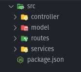
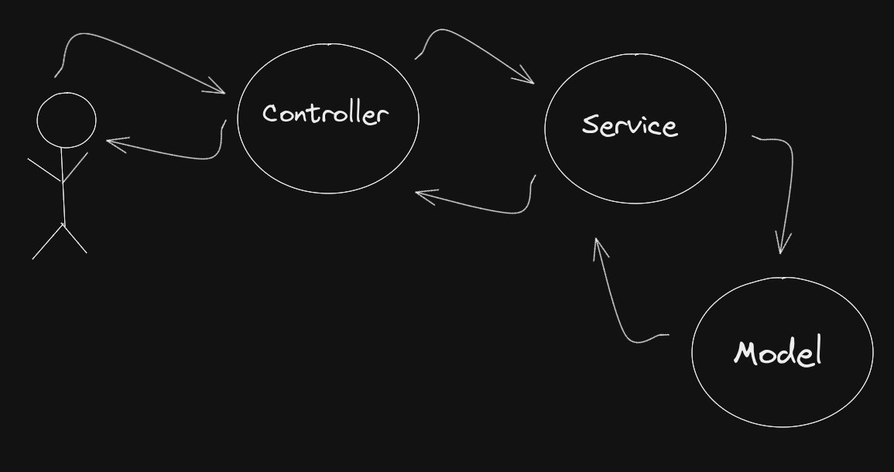

# Estrutura de pastas
É comum em projetos _Node_ as pastas seguirem a seguinte organização:

Agora explicando um pouco sobre cada pasta:

- Routes: pasta responsável por guardar todas as nossas rotas da aplicação.
- Services: pasta onde está a lógica do servidor. Digamos que cuida das regras de negócio da aplicação, por exemplo, quero criar um usuário... por meio de uma rota, que passa pela `services` verifica se o usuário já existe, faz autenticações, gerencia processos...
- Controller: pasta que recebe o que vem de aplicações externas, como Postman, Insomnia, do próprio FrontEnd. Ele faz o meio de campo entre o BackEnd e FrontEnd. O Controller recebe retornos do Services.
- Model: gerencia o banco de dados. Essa camada é chamada pelo Services.

Esse modelo é chamado de MSC:

