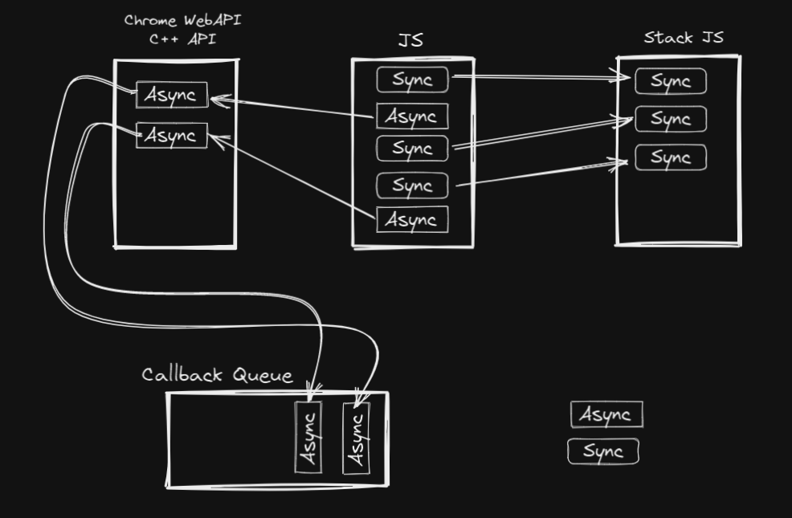

# Streaming de dados. Como funciona o filesys no Node
O Node possui um módulo para trabalhar com arquivos, que é o filesystem. Para usá-lo, precisamos importá-lo no nosso projeto.

## Utilizando o FS, _buffer vs stream_
Para importar o File System, utilizamos o seguinte comando `const fs = require('fs)`. Agora podemos usar o `fs` para ler um arquivo,
que pode ser uma imagem por exemplo.

```js
const fs = require('fs');

fs.readFile('./path/to/file', (err, buffer) => {
  fs.writeFile('./path/for/file2', buffer, (err) => {
    console.log('img escrita no file2');
  });
})
```
Nesse código estamos lendo o arquivo por meio do `readFile()` que recebe como parâmetro o _path_ do arquivo que quero ler, e como segundo parâmetro temos uma callback que recebe como parâmetro um erro e um _buffer_ que é o responsável por fazer o upload o arquivo, e temos também a função `writeFile()` que recebmos como parâmtro o caminho para o qual nossa imagem será enviada, e o segundo parâmetro é o `buffer` de memória da imagem.

Essa é uma das maneiras de fazer o _upload_ de arqivos. Porém a maneira indicada pela documentação é utilizar `stream`. Para isso vamos alterar alguns trechos de código acima. Primeiro, ao invés de utilizar a função `readFile()`, utilizaremos a função `createReadStream()`:

```js
const fs = require('fs');

fs.createReadStream('./path/to/file')
  .pipe(fs.createWriteStream('./path/for/file'))
  .on('finish', () => /* implementation */);
```
O `pipe()` auxília na conversão de um _stream_ de leitura para uma _stream_ de escrita, ele recebe como parâmetro o `fs.createWriteStream()`. Como nesse caso não temos como chamar uma callback para ser executada, concatenamos ainda no comando, o método `on()` que é relativo à ao disparo de um evento. No código acima, temos o evento de _finish_. E como segundo parâmetro passamos uma callback que será executada quando o `stream` for concluído.

## Event Loop

A engine do Node (V8) é single Thread, ou seja, executa apenas uma tarefa por vez. Mas é possível trabalhar e lidar com fluxos de código assíncronamente. Segue abaixo um esquema de como funciona esse fluxo de informação no Javascript.

