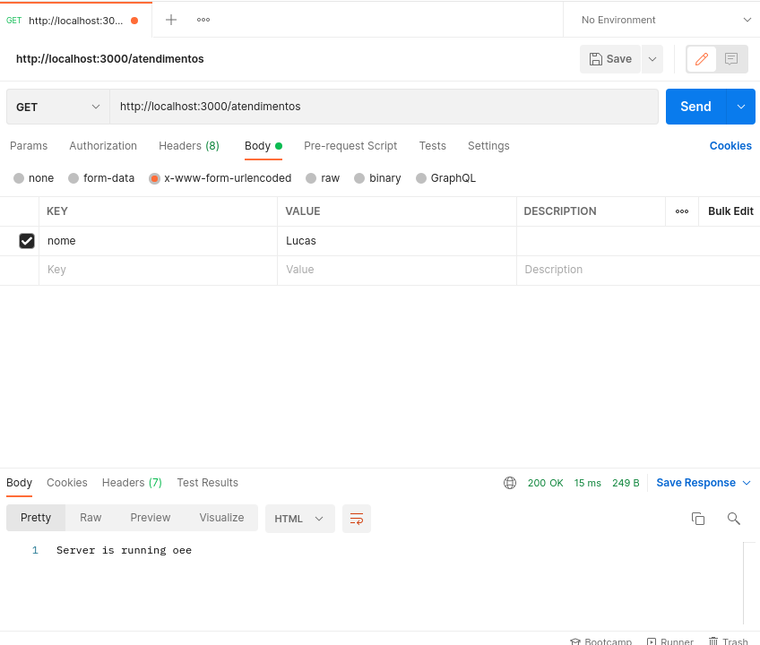

# Iniciando com o NodeJS
---
Para iniciar um projeto _Node_ no nosso computador, precisamos instalar o Node e o NPM. Logo após isso, deve ir para a pasta onde quero criar ao projeto e utilizar o comando `npm install` para criar o arquivo `package.json` que contém as informações do nosso projeto. Em seguida para inicializarmos um servidor e lidarmos com as rotas, precisamos usar um módulo do _Node_ chamado _Express_ que pode ser instalado da seguinte maneira `npm install express`. Para utilizar o _express_ precisamos importá-lo atribuindo-o a uma constante:

```js
const express = require('express');
```
## Criando rotas

Assim que eu importo o _express_ eu preciso instanciar uma aplicação:

```js
const app = express()
```
Agora que tenho minha aplicação criada posso adicionar a ela um "escutador" do servidor que é uma função que eu psso dois parâmetros, onde o primeiro é a porta que eu estou _settando_ meu server, e o segundo, uma função.

```js
app.listen(3000, () => console.log('servidor na porta 3000'))
```
Se eu executar o meu `index.js` no terminal, já que ele é por default o nosso entry point, então no nosso terminal irá aparecer essa mensagem do console.log.

Para criar uma rota é necessário usar a função `get()` que recebo como parâmentro uma rota, e como segundo parâmentro uma função que contém como argumento `req e res` que são respectivamente, o que eu recebe de uma requisição e o que eu envio para aquela rota que eu _settei_ como primeiro argumento:

```js
app.get('/', (req, res) => /* implementação */ )
```
## Instalando o Nodemon
O Nodemon é útil para não precisar ficar derrubando o server toda vez que tiver uma atualização no código. Para instalá-lo é necessaŕio utilizar o seguinte comando:
`npm install --save-dev nodemon`. Uma vez instalado podemos ir no arquivo `package.json` e na chave scripts, adicionar a chave start da seguinte maneira: `"start": "nodemon index.js"`. E pronto, está configurado o Nodemon.

## Organização do projeto

É boa prática criar pastas para deixar bem definido o papel de cada arquivo do projeto, deixando no nosso `index.js` apenas o necessário. Uma dessas práticas é criar um diretório chamado `controllers` e dentro dele colocar os arquivos `.js` para cada rota da nossa aplicação. E também criar um diretório chamado `config` e nele colocar arquivos ligados à configuração do nosso projeto, como a inicialização do nosso server pelo _express_. Segue uma imagem de como ficaria essa organização:


```js
// customExpress.js
const express = require('express');
const consign = require('consign');

module.exports = () => {
  const app = express();
  
  consign()
    .include('controllers')
    .into(app);

  return app;
}

// atendimento.js
module.exports = (app) => {
  app.get("/atendimentos", (req, res) => res.send("Server is running"));
};

// index.js
const customExpress = require('./config/customExpress')

const app = customExpress();
app.listen(3000, () => console.log('servidor na porta 3000'));
```
Estamos usando o módulo `consing` para aninhar todas rotas do nosso `controllers`. Observe que, primeiramente chamamos a função `consing()` e logo em seguida passamos para `.include()` o nome do diretório contendo os nossos controllers e dentro de `.into()` a instância da nossa chamada do `express()`.

Utilizando o Postman, podemos ver como nossa API está funcionando e como estão estruturadas os tipos de requisições, bem como seu Header e seu Body.




A API já está rodando, porém não consegumos pegar os dados que vêm do servidor e nem retornar dados válidos para quem for consumir a API independentemente se for uma aplicação Web, Mobile, etc. Para resolver esse problema, podemos usar um módulo do _Node_ chamado _body-parser_. Instalamos ele da seguinte maneira `npm install body-parser`, e utilizamos ele dentro do arquivo `customExpress`.

```js
const express = require('express');
const consign = require('consign');
const bodyParser = require('body-parser');

module.exports = () => {
  const app = express();
  
  // caso a api seja em json
  app.use(bodyParser.json());
  // caso a api provenha de forms
  app.use(bodyParser.urlencoded({ extended: true }));
  consign()
    .include('controllers')
    .into(app);

  return app;
}
```

## Criando um DataBase com MySQl
Primeiro precisamos instalar o MySQl server no Linux com o comando
`sudo apt install mysql-server` e depois de instalado podemos verificar a instalação com `mysql --version`. Depois de instalado podemos adicionar ao MySQL uma senha de usuário root, com o comando `sudo mysql_secure_installation`. Para verificar se o servidor está rodando no nosso pc, utilizamos o comando `sudo systemctl status mysql` e para iniciá-lo `sudo systemctl start mysql` e para parar `sudo systemctl stop mysql`

## Conectando o código com o DataBase
Dentro do nosso projeto criamos um diretório que vai conter nosso arquvo de conexão. Esse arquivo deve conter o seguinte código:
```js
const mysql = require('mysql');

const conexao = mysql.createConnection({
  host: 'localhost',
  port: 3307,
  user: 'root',
  password: 'senha-do-db',
  database: 'nome-do-db',
});

module.exports = conexao;
```
Estamos importando o módulo de `mysql` e estamos criando uma conexão com a função `createConnection()` que receb como parâmetro um objeto contendo informações sobre o _database_ na qual estamos nos conectando.

Uma vez feito isso, dentro do nosso arquivo de entrypoint, importamos a conexão que acabamos de criar e conectamos nosso servidor ao banco de dados utilizando a função `connect()` que pode receber como parâmetro uma callback:

```js
const customExpress = require('./config/customExpress');
const conexao = require('./infra/conexao');

conexao.connect((err) => {
  if (err) {
    console.log(err);
  } else {
    console.log('conectado');
    const app = customExpress();
    app.listen(3000, () => console.log('server in port 3000'));
  }
});
```
Essa callback recebe como parâmtro um erro. Caso o erro exista, ele será printado no console, caso não exista o servidor será "subido".

## Criando tabelas no DB
Para criar uma tabela, vamos dentro da nossa pasta onde criamos nosso arquivo `conexao.js` e criamos um script que cria essa tabela.
Dentro de um arquivo `tabelas.js`, criamos uma classe contendo o método `init()` que recebe como parâmetro a nossa conexão. Dentro desse métido instanciamos essa conexão que foi recebida como parâmetro, e chamamos o método que fizemos para criar uma tebela. Imagine que queremos criar uma tabela de atendimentos para um Petshop:
```js
class Tabelas {
  init(conexao) {
    this.conexao = conexao;

    this.criarAtendimentos();
  };

  criarAtendimentos() {
    const sql = 'CREATE TABLE IF NOT EXISTS Atendimentos (id int NOT NULL AUTO_INCREMENT,' + 
      'cliente varchar(50) NOT NULL,' +
      'pet varchar(20), servico varchar(20) NOT NULL,' +
      'status varchar(20) NOT NULL, observacoes text, PRIMARY KEY(id))';

    this.conexao.query(sql, (err) => {
      if (err) {
        console.log(err);
      } else {
        console.log('Tabela Atendimentos criada');
      }
    });
  }
};

module.exports = new Tabelas;
```
O método `criarAtendimentos()` possui um _query_ que cria uma tabela e adiciona à ela alguns campos.
Depois disso, trazemos o atributo `conexao` juntamente com a função `query()` que recebe como parâmtro a _query_ que criamos e um erro para verificarmos se a tabela foi criada com sucesso.

Dentro do nosso arquivo `index.js` importamos essa classe criada já instanciada e dentro do `else`, antes de inicializarmos o servidor, inicializamos por meio do `init()` a criação da nossa tabela.
```js
const customExpress = require('./config/customExpress');
const conexao = require('./infra/conexao');
const Tabelas = require('./infra/tabelas')

conexao.connect((err) => {
  if (err) {
    console.log(err);
  } else {
    console.log('conectado');

    Tabelas.init(conexao);
    const app = customExpress();
    app.listen(3000, () => console.log('server in port 3000'));
  }
});
```
## Persistindo os dados
Uma vez criada a Tabela e iniciada quando nosso servidor está "indo pro ar", precisamos criar um modelo (`model`) que será responsável por fazer a conexão com o banco de dados e adicionar nossos dados lá. Para isso criamos um diretório `models` e dentro dele criamos um arquivo que será responsável por fazer essa conexão e cuidar das regras de negócio. Dentro desse arquivo fazemos a importação do nosso módulo de `conexao` lá da infra. Ainda no exemplo do do petshop, podemos pensar em uma classe de Atendimentos que terá um método que adiciona um atendimento na nossa tabela de atendimento lá no banco de dados:
```js
const conexao = require('../infra/conexao');

class Atendimentos {
  adiciona(atendimento) {
    const sql = 'INSERT INTO Atendimentos SET ?';
    conexao.query(sql, atendimento, (err, resultados) => {
      if (err) {
        console.log(err);
      } else {
        console.log(resultados);
      }
    });
  }
}

module.exports = new Atendimentos;
```
No código acima temos um método `adiciona()` que recebe como parâmetro um atendimento. Temos também uma _query_ SQL que insere dentro de atendimentos alguma coisa, por isso o ponto de interrogação. Por fim utilizamos nossa conexão e chamamos a função `query()`, que recebe como parâmetro a _query_, o atendimento passado por parâmetro para o `adiciona(atendimento)`, e como último parâmetro uma callback contendo um erro e também um obejto `resultados` que serviram para verificar se a operação foi feita com sucesso. 

Agora é preciso voltar para o controller, é ele quem é responsável por disparar essa requisição:
```js
const Atendimentos = require('../models/atendimentos');

module.exports = app => {
  app.get('/atendimentos', (req, res) => res.send('Você está na rota de atendimentos'));

  app.post('/atendimentos', (req, res) => {
    const atendimento = req.body;
    Atendimentos.adiciona(atendimento);
    res.send('Você está na rota de atendimantos e POST');
  });
}
```
Vemos que chamamos esse model, dentro da chamada do `.post`. 

