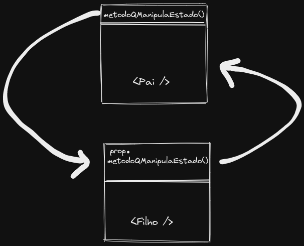

# Formulários no React

---

Formulários em _React_ possuem um comportamento diferente do que o comportamento em _HTML_. No HTML, a própria _DOM_ guardava as informações inseridas no formulário. Já em '_React_', quem faz isso é o `state` do componente. Veja o exemplo a seguir:

```jsx
import React, { Component } from "react";

class Form extends Component {
  constructor() {
    super();
    this.state = {
      name: "",
      age: 0,
    };
    this.handleNameChange = this.handleNameChange.bind(this);
  }

  handleNameChange(e) {
    this.setState({
      name: e.target.value,
    });
    this.setState((previousState) => ({
      contador: previousState.contador + 1,
    }));
  }

  render() {
    const { name } = this.state;

    return (
      <form>
        <label>
          Nome
          <input type="text" value={name} onChange={this.handleNameChange} />
        </label>
      </form>
    );
  }
}

export default Form;
```

Vemos também que no `value` input, passamos o valor da `key` correspondente do objeto `state`. Agora vem a pergunta: Se eu tivesse mais 10 campos nesse formulário, precisaria criar um `handle` para cada um? Não!! É possível criar um `handle` genérico para todos os campos. Da seguinte maneira:

```jsx
import React, { Component } from "react";

class Forms extends Component {
  constructor() {
    super();
    this.state = {
      name: "",
      age: 0,
      recieveEmails: false,
    };
    this.handleChange = this.handleChange.bind(this);
  }

  handleChange({ target }) {
    const { name } = target;
    const value = target.type === "checkbox" ? target.checked : target.value;

    this.setState({
      [name]: value,
    });
  }

  render() {
    const { name, age, recieveEmails } = this.state;

    return (
      <form>
        <label>
          <input
            type="text"
            value={name}
            name="name"
            onChange={this.handleChange}
          />
        </label>
        <label>
          <input
            type="number"
            value={age}
            name="age"
            onChange={this.handleChange}
          />
        </label>
        <label>
          <input
            type="checkbox"
            value={recieveEmails}
            name="recieveEmails"
            onChange={this.handleChange}
          />
        </label>
      </form>
    );
  }
}

export default Forms;
```
É possível transmitir informações de um componente pai para um componente filho. Para exmplificar isso, fracionei o código acima em componentes para que cada input seja um componente filho de `Forms`, veja bem:

```jsx
// Name.jsx
import React, { Component } from 'react';
class Name extends Component {
  render() {
    const { name, handleChange } = this.props;

    let error = undefined;
    if (name.length > 200) error = 'Nome inválido';

    return (
      <label>
        <input
          type="text"
          value={name}
          name="name"
          onChange={handleChange}
        />
        <span>{error ?? ''}</span>
      </label>
    );
  }
}

export default Name;

// Age.jsx
import React, { Component } from 'react';
class  extends Component {
  render() {
    const { age, handleChange } = this.props;
    return (
      <label>
        <input
          type="number"
          value={age}
          name="age"
          onChange={handleChange}
        />
      </label>
    );
  }
}

export default Age;

// RecieveEmails.jsx
import React, { Component } from 'react';
class RecieveEmails extends Component {
  render() {
    const { recieveEmails, handleChange } = this.props;

    return (
      <label>
        <input
          type="checkbox"
          value={recieveEmails}
          name="recieveEmails"
          onChange={handleChange}
        />
      </label>
    );
  }
}

export default RecieveEmails;

// Forms.jsx
import React, { Component } from "react";
import Name from './Name';
import Age from './Age';
import RecieveEmails from './RecieveEmails';

class Forms extends Component {
  constructor() {
    super();
    this.state = {
      name: "",
      age: 0,
      recieveEmails: false
    };
    this.handleChange = this.handleChange.bind(this);
  }

  handleChange({ target }) {
    const { name } = target;
    const value = target.type === "checkbox" ? target.checked : target.value;

    this.setState({
      [name]: value
    });
  }

  render() {
    const { name, age, recieveEmails } = this.state;

    return (
      <form>
        <Name value={name} handleChange={this.handleChange} />
        <Age value={age} handleChange={this.handleChange} />
        <RecieveEmails value={recieveEmails} handleChange={this.handleChange} />
      </form>
    );
  }
}

export default Forms;
```
Coisas que devemos notar à partir desde código. 
- O componente pai gerencia o estado como um todo, incluse o estado dos filhos.
- Posso passar o estado do pai como uma propriedade para os filhos.
- Posso passar também o método que gerencia o estado como propriedade para os filhos, dessa forma o filho pode chamar o método do componente pai:




