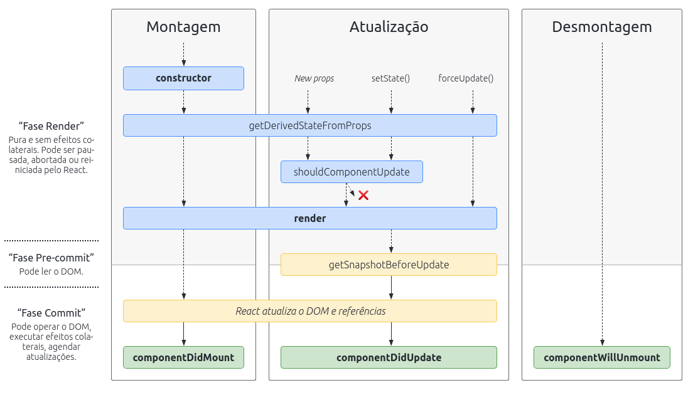

# Ciclo de vida dos componentes

 As funções de ciclo de vida do componente vêm para nos dar o controle necessário para utilizar cada recurso no momento certo e para garantir que a assincronicidade do React não prejudique a lógica do que você está tentando executar. Seja para a chamada de uma API , seja para atualização de algum elemento gráfico, é fundamental respeitar o momento em que seu componente se encontra.

---
Os componentes _React_, assim como os seres vivos, possuem um ciclo de vida. No caso, o ciclo é dividido em 3 etapas. São elas:
- Montagem: quando o componente é inicializado e inserido no DOM
  - componentDidMount - dispara uma ou mais ações após o componente ser inserido no DOM (ideal para requisições) ;
- Atualização: quando o props ou estados do componente são alterados
  - shouldComponentUpdate(nextProps, nextState) - possibilita autorizar ou não o componente a atualizar e permite acessar os próximos estados e propriedades. Retorna um `boolean`;
  - componentDidUpdate(prevProps, prevState) - dispara uma ou mais ações após o componente ser atualizado e permite acessar os estados e propriedades anteriores;
- Desmontagem: quando o componente morre, sumindo do DOM.
  - componentWillUnmount - dispara uma ou mais ações antes de o componente ser desmontado.



## Exemplo em uma requisição de API
```jsx
class DadJoke extends React.Component {
  constructor() {
    super();

    this.saveJoke = this.saveJoke.bind(this);
    this.renderJokeElement = this.renderJokeElement.bind(this);

    this.state = {
      jokeObj: undefined,
      loading: true,
      storedJokes: [],
    }
  }

  async fetchJoke() {
    this.setState(
      { loading: true }, // Primeiro parâmetro da setState()!
      async () => {
      const requestHeaders = { headers: { Accept: 'application/json' } }
      const requestReturn = await fetch('https://icanhazdadjoke.com/', requestHeaders)
      const requestObject = await requestReturn.json();
      this.setState({
        loading: false,
        jokeObj: requestObject
      });
    });
  }

  componentDidMount() {
    this.fetchJoke();
  }

  saveJoke() {
    this.setState(({ storedJokes, jokeObj }) => ({
      storedJokes: [...storedJokes, jokeObj]
    }));

    this.fetchJoke();
  }

  renderJokeElement() {
    return (
      <div>
        <p>{this.state.jokeObj.joke}</p>
        <button type="button" onClick={this.saveJoke}>
          Salvar piada!
        </button>
      </div>
    );
  }

  render() {
    const { storedJokes, loading } = this.state;
    const loadingElement = <span>Loading...</span>;

    return (
      <div>
        <span>
          {storedJokes.map(({ id, joke }) => (<p key={id}>{joke}</p>))}
        </span>

      <p>{loading ? loadingElement : this.renderJokeElement() }</p>

      </div>
    );
  }
}
```