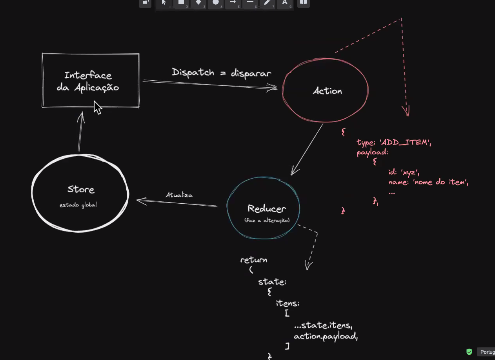
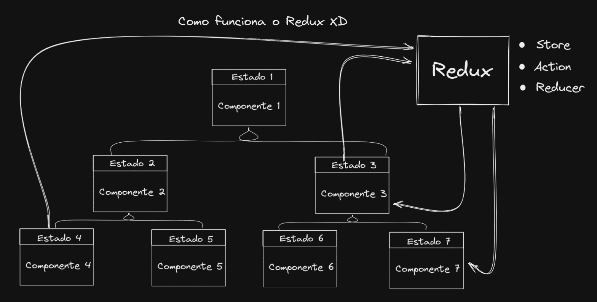
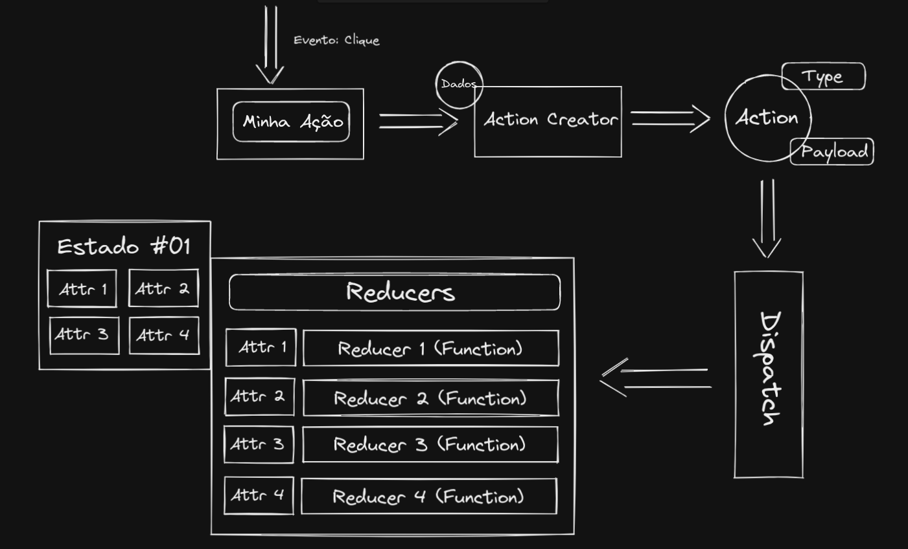

# Introdução ao Redux
## O estado global da aplicação
O _Redux_ é uma biblioteca utilizada para gerenciar o estado de uma aplicação. Ele veom com o objetivo de resolver problemas de fluxo de informação dentro da sua aplicação.
O _Redux_ é a junção de diversas engrenagens e agentes que controlam o estado.
São eles:
- **Store**: É onde vamos armazenar todos os dados compartilhados da aplicação e é representado por um objeto JavaScript. O State é armazenado no Store do _Redux_.
- **Action**: É um objeto JavaScript que representa alguma mudança/alteração que precisa acontecer no State.
- **Reducer**: É uma função JavaScript que recebe o estado atual (_current state_) e a ação corrente (_current action_) e retorna um novo estado (_new state_). É responsabilidade dessa função decidir o que acontecerá com o estado dada uma ação (_action_).
- **Dispatch**: É uma função que envia uma ação (_action_) para processamento.
- **getState**: É uma função que recupera o estado armazenado no store.

## Criando a Store:
Agora vamos criar uma `store` e vamos acessá-la, retornando o estado que guardamos nela e criando uma `action` para alterá-lo. Primeiro vamos criar e retornar a nossa `store`.
```js
const store = Redux.createStore();
```
Porém, o `store` só funciona se passarmos para ele um `reducer`:
```js
const reducer = (state) => {
  return state;
};

const store = Redux.createStore(reducer);
```
A princípio, o `state` vem como `undefined`, então precisamos atribuir a ele um valor padrão:
```js
const reducer = (state = { login: false, email: '', }) = {
  return state;
};
const store = Redux.createStore(reducer);
```
Essa síntaxe fica ilegível caso tenhamos um `state` muito grande. Então podemos abstraí-lo para um objeto x, e passar esse objeto x como state para nosso `reducer`:
```js
const ESTADO_INICIAL = {
login: false,
email: "",
};

const reducer = (state = ESTADO_INICIAL) => {
return state;
};

const store = Redux.createStore(reducer);
```
Agora é possível acessar o `store` por meio de uma função que o traz para mim, que é `getState()`:

```js
const ESTADO_INICIAL = {
login: false,
email: "",
};

const reducer = (state = ESTADO_INICIAL) => {
return state;
};

const store = Redux.createStore(reducer);
console.log(store.getState()) //{ login: false, email: '' }
```





